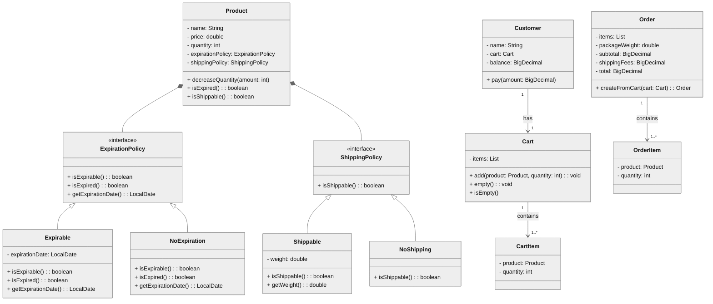

# E-commerce System

A simple Java-based e-commerce system built for the **Awry Rise Journey Challenge**.  
This system handles product management, cart operations, checkout flow, shipping calculations, and expiry validations.

---

## Features

- Define products with name, price, quantity.
- Support both **expirable** (e.g., Cheese, Biscuits) and **non-expirable** (e.g., TV, Mobile) products.
- Support **shippable** and **non-shippable** products.
- Products requiring shipping must provide weight.
- Customers can add products to cart with quantity constraints.
- On checkout:
  - Handles validations (stock, expiry, balance, empty cart)
  - Calculates subtotal, shipping fees, and total
  - Prints checkout and shipping details to console
- Sends shippable products to a `ShippingService`.

---

## Class Diagram



## Example Usage

```java
Product cheese = new Product("Cheese", 100, 5,
    new Expirable(LocalDate.of(2025, 9, 1)),
    new Shippable(200));

Product biscuits = new Product("Biscuits", 150, 3,
    new Expirable(LocalDate.of(2025, 10, 1)),
    new Shippable(700));

Product scratchCard = new Product("Scratch Card", 50, 10,
    new NoExpiration(),
    new NoShipping());

Customer customer = new Customer("Abdelrahman", BigDecimal.valueOf(1000));

Cart cart = new Cart();
cart.add(cheese, 2);
cart.add(biscuits, 1);
cart.add(scratchCard, 1);

OrderService orderService = new OrderServiceImpl(new ShippingServiceImpl(), new CartItemToOrderItemMapper());

Order order = orderService.checkout(customer, cart);

OrderUtils.printOrder(order);
```

## Console Output


